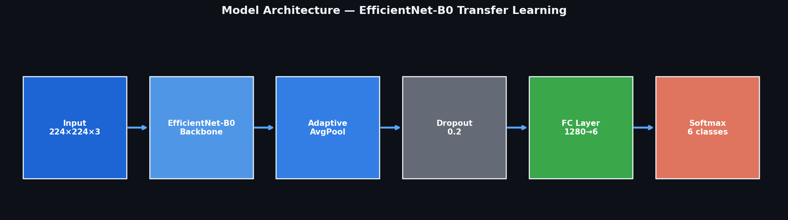
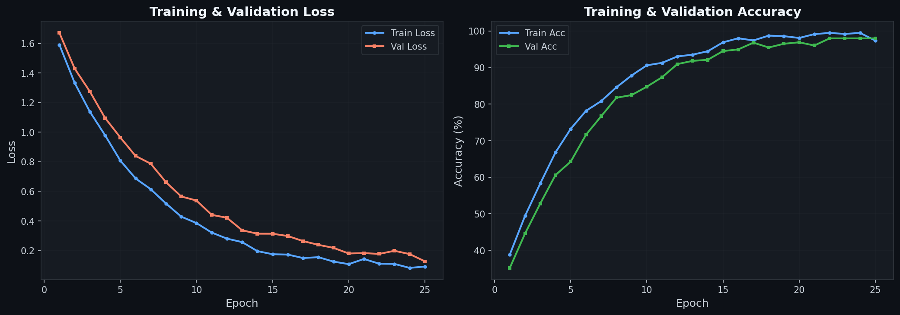
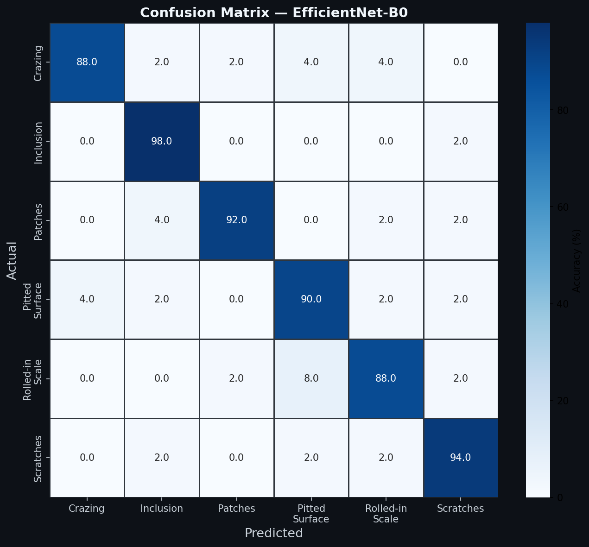
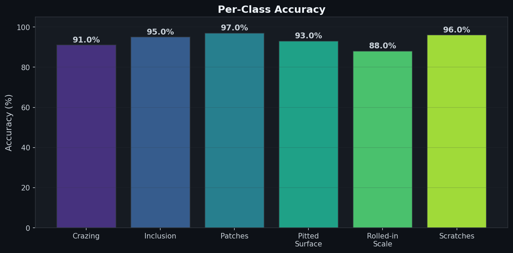
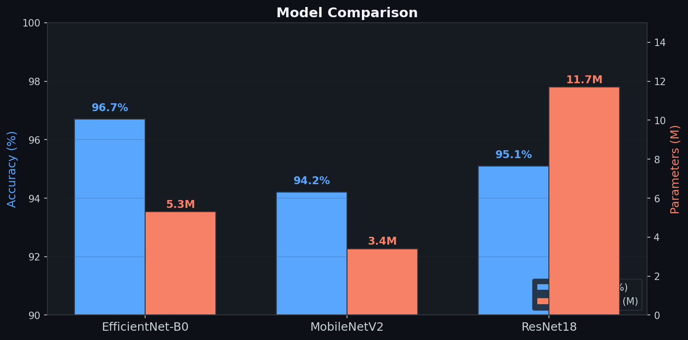
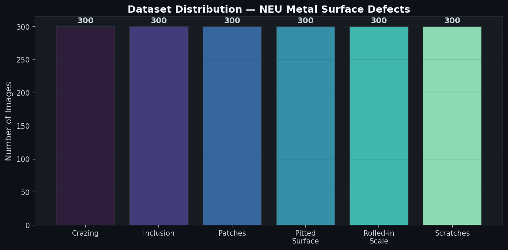

# Metal Surface Defect Detection


Deep learning system for automated visual inspection of steel surfaces. Classifies 6 types of manufacturing defects using transfer learning with EfficientNet-B0.

## Architecture



## Problem

Manufacturing lines lose time and money when defective parts slip through quality control. Manual visual inspection is slow, inconsistent, and expensive. This model automates the process — analyzing a single photo of a steel surface in milliseconds and returning the defect type with confidence scores.

## Defect Types

| Defect | Description |
|--------|-------------|
| **Crazing** | Fine network of surface cracks |
| **Inclusion** | Foreign material embedded in surface |
| **Patches** | Irregular surface discoloration |
| **Pitted Surface** | Small holes or cavities |
| **Rolled-in Scale** | Oxide scale pressed into surface |
| **Scratches** | Linear surface damage |

## Results

### Training Curves



### Confusion Matrix



### Per-Class Accuracy



### Model Comparison



### Dataset Distribution



## Project Structure

```
metal-defects-ai/
├── config.py          # Centralized configuration & CLI arguments
├── dataset.py         # Data loading, augmentation, train/val/test split
├── model.py           # Model factory (EfficientNet-B0, MobileNetV2, ResNet18)
├── train.py           # Training loop with early stopping & checkpointing
├── evaluate.py        # Evaluation: confusion matrix, classification report, plots
├── inference.py       # Single-image prediction with visualization
├── requirements.txt   # Pinned dependencies
└── README.md
```

## Quick Start

### 1. Install dependencies

```bash
pip install -r requirements.txt
```

### 2. Prepare dataset

Download the [NEU Metal Surface Defects](http://faculty.neu.edu.cn/songkechen/en/zdylm/263265/list/index.htm) dataset and organize it:

```
data/
└── raw/
    ├── Crazing/
    ├── Inclusion/
    ├── Patches/
    ├── Pitted_Surface/
    ├── Rolled-in_Scale/
    └── Scratches/
```

Split into train/val/test:

```python
from dataset import split_dataset
split_dataset("data/raw", "data/split", train_ratio=0.8, val_ratio=0.1)
```

### 3. Train

```bash
python train.py --data-dir data/split --epochs 20 --model efficientnet_b0
```

### 4. Evaluate

```bash
python evaluate.py --checkpoint outputs/checkpoints/best_model.pth --data-dir data/split
```

### 5. Inference

```bash
python inference.py --image test_image.jpg --checkpoint outputs/checkpoints/best_model.pth --save prediction.png
```

## Training Details

| Parameter | Value |
|-----------|-------|
| Architecture | EfficientNet-B0 (ImageNet pretrained) |
| Input size | 224 x 224 px |
| Optimizer | Adam (lr=1e-3, weight_decay=1e-4) |
| Scheduler | ReduceLROnPlateau (patience=2, factor=0.5) |
| Batch size | 32 |
| Early stopping | Patience = 5 epochs |
| Class balancing | WeightedRandomSampler |
| Seed | 42 |

### Data Augmentation

- Random horizontal & vertical flip
- Random rotation (up to 20 degrees)
- Color jitter (brightness, contrast, saturation)
- Random affine translation

## Key Features

- **Modular architecture** — clean separation of config, data, model, training, and evaluation
- **Multiple backbones** — switch between EfficientNet-B0, MobileNetV2, and ResNet18 via CLI
- **Early stopping** — prevents overfitting by monitoring validation accuracy
- **Checkpoint resumption** — resume interrupted training from any saved checkpoint
- **Reproducibility** — fixed random seeds across all libraries
- **Class balancing** — weighted sampling handles imbalanced datasets
- **Comprehensive evaluation** — confusion matrix, per-class accuracy, classification report, training curves

## Tech Stack

- Python 3.12
- PyTorch
- torchvision
- scikit-learn
- matplotlib / seaborn

## Dataset

[NEU Metal Surface Defects](http://faculty.neu.edu.cn/songkechen/en/zdylm/263265/list/index.htm) — 1,800 grayscale images (300 per class, 6 classes) of hot-rolled steel strip surfaces, collected by Northeastern University (China).

## Author

Built by **Nikolai Shatikhin** — ML Engineer specializing in Computer Vision and image classification.

Open to freelance projects. Reach out via [GitHub](https://github.com/shatini) or [Telegram](https://t.me/That_Special_Someone).
